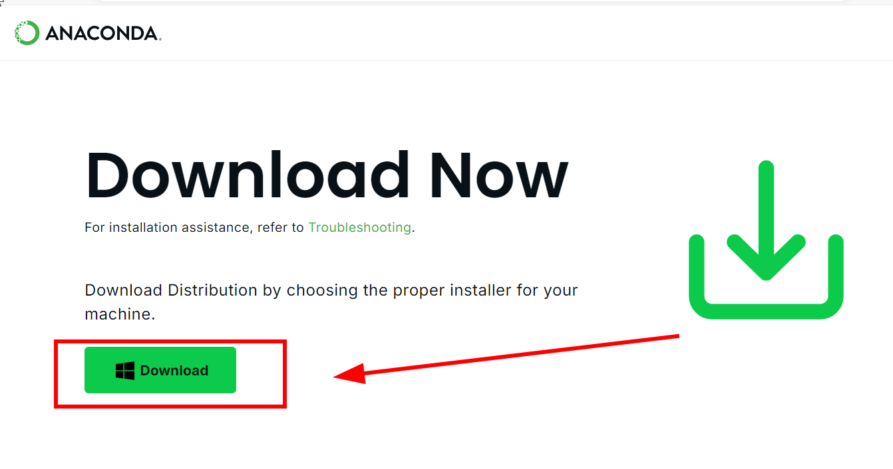
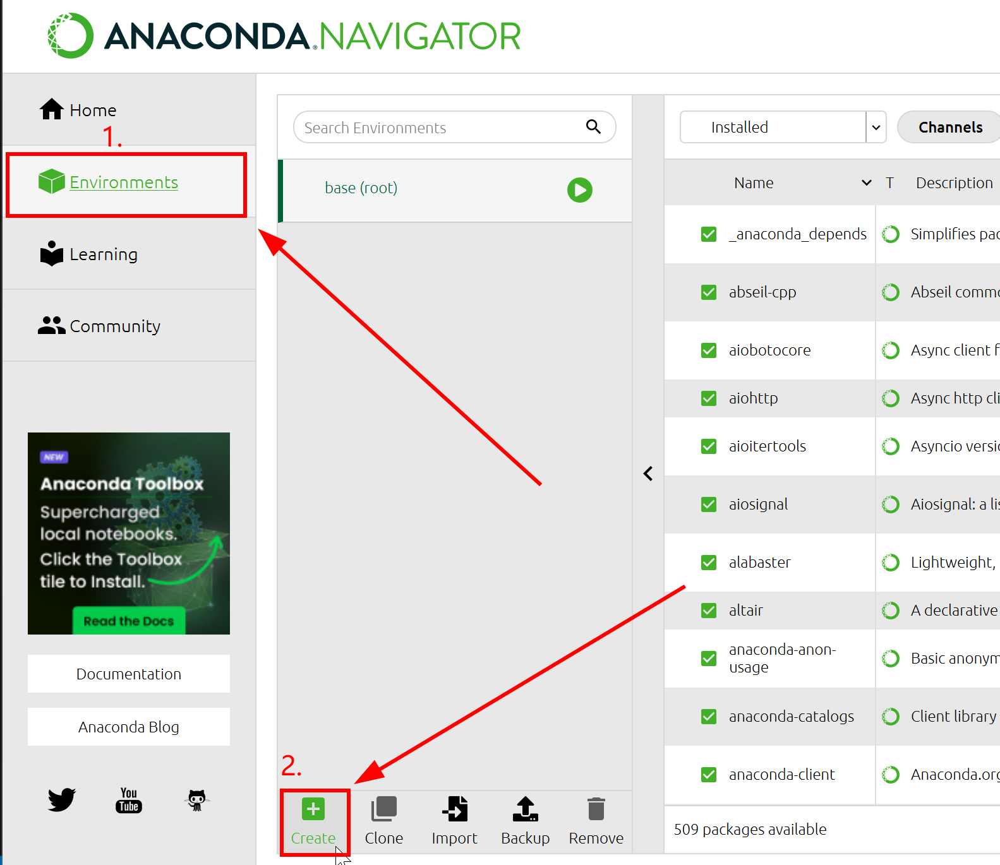
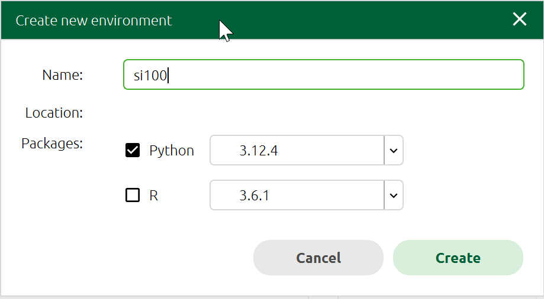

# 在开始之前……

<!--v-->

## 有关计算机基本操作的推荐阅读

[你缺失的那门计算机课](https://www.criwits.top/missing/) 入门：计算机快速上手

[MIT: Missing Semester](https://missing-semester-cn.github.io/) 进阶：需配置好 Bash 环境

<!--v-->

## 小调查

有多少人在暑假上过 SI100+ 这门“先导课”？

- 如果上过，那么你可能已配置好和本次习题课所说的一致的编程环境
- 为保险起见，仍然建议你跟着听一遍

如果你做过正课上的动手尝试环节…
- 那么你可能已安装了一个独立 Python 环境（`python.org` 或微软商店上下载的）
- 如果是，请务必按本节课所述的配置教程进行


<!--v-->

## 配置编程环境

在本教程中，我们将配置一套可用于 SI100B 课程的环境：

### Anaconda + Jupyter Notebook + VS Code

<!--v-->

### Anaconda + Jupyter Notebook + VS Code

- Anaconda 是一个 Python *发行版* (distribution)

  - Anaconda = Python + `conda` + 预装的软件包

  - `conda` 是现代的 Python 环境管理器
    - 提供 **软件包批量管理、环境管理** 等功能
    - 稍后会解释为什么需要环境管理

- **不使用** `python.org` 或微软商店的独立安装包：Anaconda 提供了统一的**环境管理**功能

- 缺点：预装大量软件包，体积很大（~4 GiB），在配置低的机器上性能不佳
  - 派生的 Miniconda 也是不错的选择：体积更小，更轻量

<!--v-->

### Anaconda + Jupyter Notebook + VS Code

- Jupyter Notebook：一个交互式笔记本
  - 在一个文档里运行代码，可以融合文本、公式、图像等多种元素
  - 非常适合撰写数据处理和分析报告
  - 在之后的课程中用到，到时会详细介绍

- Visual Studio Code：简称 VS Code，广受欢迎的文本编辑器
  - 优点在于丰富的插件生态，因而支持多种编程语言（包括 Python！）

<!--v-->

## 不要安装多个 Python！

<div style=" margin-top: 10px; margin-right: 10px;" markdown="1">

<br/>

- 同一台机器上的不同项目：
  - 使用的 Python 版本不同
  - 对应使用的软件包/库不同

- 直接安装在一起，极有可能相互干扰（如右图）

- 如何建立和管理 Python 软件包环境？

</div>

<!--v-->

## 正确做法：环境管理

**环境管理器**：用于管理不同的 Python 环境，如 `conda`, `venv`

- 环境之间互相隔离，互不干扰，且可通过命令快速切换

- 作业和期末项目可能使用不同的环境，因此强烈建议使用环境管理器

- 如之前所述， Anaconda 使用 `conda` 这一环境管理器
  - 将在安装 Anaconda 时简单教学：如何创建和使用环境

<!--v-->

## 配置环境**前**的常见问题

> “我照着教程装了 PyCharm，它自带了一个 Python”  
> “我从 python.org / 微软商店 下载安装了一个 Python”

这些可以正常使用，但**不建议在这门课中**使用它们
- 安装软件包、环境管理…等一系列可能的问题

- 助教**只能对前述的 Anaconda + Jupyter Notebook + VS Code 环境提供帮助**
  - 对于其他自行安装的环境，由于情况较多，助教很可能无法提供帮助
  - 如果要卸载自行安装的环境并按照本教程配置环境，建议卸载完成后**先重启**再进行安装

<!--v-->

## 配置环境时的常见问题

- **用户名应当为全英文**
  - 中文用户名可能导致无法安装软件
  - 打开终端，输入 `whoami` 并按回车执行，输出中不应包含中文字符

    - 可在程序集或搜索框中搜索“终端”或类似词语，以打开终端

- 所有步骤均在 Windows 11 操作系统下演示

  - 对于 macOS/Linux 等其他操作系统，步骤基本一致；如遇到问题，可询问使用对应操作系统的助教（现场可能就有）

- 如果遇到其他任何问题，也欢迎在 Piazza 上发帖，或在 Office Hour 期间向助教求助

- 搜索对应软件时，百度等中文搜索引擎给出的**前几个中文链接通常为诈骗广告**，请先确认网址再下载

<!--s-->

# 安装和配置 Anaconda

<!--v-->

## 安装 Anaconda

- 打开浏览器，访问 Anaconda 官网下载页面 (www.anaconda.com/download/success) ，点击 Download 按钮开始下载

  - 如果你访问的是首页 (www.anaconda.com) ，那么先点击页面上方 "Free Download"，跳转后再点击 "Skip Registration" 灰色小字，方能看到下载按钮

- 如果速度很慢或不能下载，可选择国内镜像下载，如 [清华大学镜像站](https://mirrors.tuna.tsinghua.edu.cn/anaconda/archive/?C=M&O=D)



<!--v-->

## 安装 Anaconda

- 下载完成后运行安装程序
- 点击 Next/I Agree 几次后会出现安装位置选择界面（如下图），如不确定要安装到哪个位置，直接点击 Next 即可


- 接下来的选项一般不需要改变，一路点击 Next/Install 直到安装完成即可

<!--v-->

## 启动 Anaconda Powershell Prompt

- 安装完成后，会自动打开 Anaconda Navigator；这是 Anaconda 的软件汇总中心，可在这里找到 Anaconda Powershell Prompt
- 也可在开始菜单中找到 Anaconda Powershell Prompt 和 Anaconda Prompt


<!--v-->

## 创建一个新的 Python 环境

- 在 Anaconda Navigator 中，点击左侧的 Environments（环境）`->` Create（创建）



<!--v-->

## 创建一个新的 Python 环境

- 输入环境的名字，比如 `si100`，然后点击 Create
- 这样就创建好了一个环境



<!--v-->

## 安装后的常见问题
> 安装后在终端输入 `python`，提示找不到（或弹出微软应用商店的 Python 下载页面）

在一般终端中，Anaconda 环境不启用。

- 解决方法：打开上面提到的 Anaconda Powershell Prompt / Anaconda Prompt，并在此弹出的终端窗口中输入即可
- VS Code 会在打开项目时让你选择一个环境并自动激活，不需要上述方法
  - 使用 VS Code 内置的终端即可（按 `Ctrl + J` 显示/隐藏）
- 另外的方法：将 Anaconda 环境添加到系统环境变量（PATH）
  - 在所有终端中启用 Anaconda 环境
  - 这样做会导致 Python 环境变量混乱，我们不推荐此方法

<!--s-->

# 安装和配置 Visual Studio Code

<!--v-->

## 安装 VS Code

- 打开浏览器，访问 VS Code 官网下载页面 (https://code.visualstudio.com/Download) ，选择对应你的操作系统的版本下载


<!--v-->

## 安装 VS Code

- 下载完成后，运行安装程序
- 点击同意协议


<!--v-->

## 安装 VS Code

- 选择安装位置
- 如不确定要安装到哪个位置，直接点击 下一步 即可


<!--v-->

## 安装 VS Code

- 在选择附加任务的界面，将下图红框中的全部选项勾选上


- 继续一路点击 下一步 ，完成安装

<!--v-->

## 为 VS Code 安装插件

- 打开 VS Code，点击左侧边栏的 Extensions（扩展程序）图标

- 强烈建议安装：（如没有自动推荐，可在搜索框中搜索对应名称来安装）
  - "Python": 官方 Python 语言支持，提供更好的语法分析、调试器、代码跳转等
  - "Jupyter": 在 VS Code 里渲染和编辑 Jupyter Notebook


<!--v-->

## 为 VS Code 安装插件（续）

- 你也可以自行安装其他插件，如颜色主题、自动整理代码格式等
  - 插件也可能含有病毒或恶意软件，请**不要**下载很冷门或可疑的插件！

<div style="position: absolute; bottom: -20vh; text-align: center;">

#### 到此，我们的环境配置初步完成。
非常感谢 SI100+ 等先前课程同学提供的相关资料。

</div>


<!-- ## 在 VS Code 中使用 Jupyter Notebook

- 新建一个文件夹，命名为 `SI100B`
- 将 Piazza 上的本课的 Jupyter Notebook 文件（`.ipynb` 文件）移动到 `SI100B` 文件夹中
- 在 Anaconda Navigator 中找到 VS Code 点击 Launch，令 VS Code 可以找到 Anaconda 中的 Python 环境
- 在 VS Code 中点击顶部菜单栏的 File `->` Open Folder，打开刚刚新建的 `SI100B` 文件夹
- 点击左侧边栏的 `.ipynb` 文件，即可打开文件，跟随 Notebook 的内容继续学习

<div style="position: absolute; bottom: -20vh; text-align: center;">

### 到这里，我们的环境配置初步完成！🎉
### 特别感谢SI100+同学提供的相关资料。

</div> -->

<!--s--> 

# Administrivia 课程管理说明

<!--v-->

## 关于作业和考试

本学期 SI100B 的 Python 编程 (Python Programming) 部分共有 3 次作业

- 成绩通过在线评判机（Online Judge，简称 OJ）进行评判；

- 详情将在第一次作业发布时（计划下周五）公布

Python 编程部分共有 1 次考试

- 暂定为上机测试，详情在期中前公布

<!--v-->

## 关于作业：续

请每位同学**独立**完成作业：如发现有抄袭行为，将按学校规定处理。

不要让 ChatGPT 等大模型替你完成作业！这不仅违反了规定，还违背了作业的目的：回顾和练习。

##### **Recall:**

- **Do s:** all work should be done **individually and independently**
- **Don't s:**
  - **copy** from the web or others (**including AI tools**);
  - **give or expose** your code to others;
  - make your code **public**


<!--s--> 

# 正确地使用搜索引擎

内容改自 SI100B Fall 2024 习题课

<!--v-->

## 为什么使用搜索引擎？—— 你应该开始搜索的 101 个理由

- 你现在真的遇到问题了，而遇到问题就应该**解决问题**
- 网上很可能有这个问题的解决方案
- 只靠自己摸索不一定能解决问题
- 可能会搜索到高于这个问题的更深入的知识，扩充你的知识面
- 搜索没有任何的代价
- 这一次没有搞懂，下一次还要再费时间
- 别人通常没有义务帮你解决问题，你应该感谢他们的帮助，但是搜索引擎无所谓！
- 找出思路里面潜在的错误
- ......

<!--v-->

## 通用的搜索引擎

这些搜索引擎可以解决大部分问题

- Google

- Bing（海外版）

- CN Bing 国内版/百度（仅适合搜索中文社区内容，如“百度贴吧”）

- 百度等中文搜索引擎，编程相关的结果存在较多 AI 洗稿和无意义回答，请注意甄别

<!--v-->

## 如何搜索——关键词

- 搜索一大段描述文字，结果通常不尽人意
  - 搜索引擎有分词功能，但效果有限
  - 长句子即便分词后也有很多杂音

- 清除冗余：搜索 “我该怎么用工具 x 做出 y?” `->` 搜索 “x y”
  - 空格分隔关键词，视情况选择具体的还是更抽象的关键词

- 根据搜索结果调整关键词
  - 结果不应包含某些关键词，那就去掉；
  - 结果给了你新的启发，那就加入相关的关键词；
  - 根据结果不断迭代：
    - 内容太老旧 `->` 限制搜索时间/加年份关键词/加软件版本号
    - 名字一样，但是不是你要搜的领域的东西 `->` 加上领域关键词
    - ......

<!--v-->

## 搜索引擎的高级功能

以 Google 为例，其他搜索引擎使用方式类似

<div style=" margin-top: 10px; margin-right: 20px; margin-left: 20px" markdown="1">

| 功能 | 语法示例 | 说明  |
|------------|--------|--------|
| 强制包含关键词 | `"Python tutorial"` | 使用半角双引号，结果须完全包含引号内的词组 |
| 强制排除关键词 | `Python -Java` | 在词组前加减号，结果中不会出现被排除的词 |
| 模糊匹配 | `Python * tutorial` | 星号 `*` 可匹配任意单词，如可能给出 `Python science tutorial` 的结果|
| 限制搜索网站 | `site:python.org Python` | 只在指定网站中搜索 |
| 限制搜索文件类型 | `filetype:pdf Python` | 只搜索特定文件类型（如 PDF） |

也可以使用浏览器插件实现相关功能。

</div>

<!--v-->
## AI 工具

**常用站点**

- Microsoft Copilot / GitHub Copilot
- ChatGPT 
- 上科大同学可免费使用校内的 GenAI 平台：https://genai.shanghaitech.edu.cn

- 课程中（可能）会教学如何使用 AI 工具，如辅助编程
  - 再次提醒：用 AI 代写作业**违反课程规定！**

<!--v-->
## 如何正确使用对话大模型

**向大模型提问的正确方式**

- 搜索引擎的“关键词”式搜索不一定合适
- 用更加详细的方式描述
- 任何要求都要写清楚
- 有些时候，说“不应该怎样”反而会加强错误

**什么适合问大模型？**

- 概览性问题

- 已有大量数据的问题
  - 大模型可能出现幻觉，给出错误数据或不存在的证据


<!--s--> 

# Python 程序运行的背后：计算机基本构成和运行原理

<!--v-->

## 计算机的构成
<div style=" margin-top: 10px; margin-right: 10px;" markdown="1">


一台计算机通常含有如下组件：
- 中央处理器（CPU）：核心组件，提供运行所需的基本计算能力
- 内存（RAM）：临时储存，速度相对较快，断电后其上数据丢失
- 硬盘（Hard Drive）：有固态 (SSD)，机械 (HDD) 等不同种类；大容量储存，速度相对较慢，断电后其上数据仍保留
- 显卡（GPU）：擅于图形渲染，，批量小规模计算（如矩阵）和并行处理，但计算能力远不如 CPU 通用
- 电源（Power Supply）：向主板（以及显卡）直流供电
- 主板（Motherboard）：卡槽和总线，连接各个部件，提供外部接口（USB、耳机口），可能带有网卡、wifi天线等等
- 风扇：（主要给CPU）散热；显卡往往有独立的散热系统

</div>

<!--v-->
## 程序在哪里？

- 在计算机的最底层，所有东西都是**二进制**表示
  - 不同的文件种类，只是编码 (encoding) 不同
- 内存同时装载**数据和程序**
- 包含机器码的文件就是**可执行文件**，即程序，装载到内存中可以直接被CPU执行
- 程序的工作是根据输入数据计算对应的输出，所以是一个**函数**
- Python语言本身是一个程序，**代码**是这个程序的输入
- 所以我们编写的是**脚本**，而终端调用的“python3”是**解释器**
- 可以被复用的程序称为**库**（Library），可能是文本形式的代码（如 Python module），也可能是二进制的机器码（比如动态链接库）

<!--v-->
## VS Code 与 Python

- VS Code 是**代码编辑器**。其核心部分为文本编辑器（与记事本同类）
  - 它**不是 IDE（集成开发环境）**：不能仅用它来直接开发程序
  - Python 解释器是独立于它存在的（比如，你可以在终端直接运行 `python3`）
- VS Code 内置或可添加许多有利于编程的功能：
  - 内置了代码高亮、括号匹配等功能
  - 安装对应插件，可为编程语言提供更全面的支持
- 编辑器和 IDE 都可以统一管理项目文件，并配合外部工具实现版本控制和可视化调试等功能


<!--v-->
## Facts about Python

- 'The Zen of Python': 输入 `import this`
- 来自 1989 年 Guido Van Rossum 在圣诞节期间的业余项目
- 得名于喜剧片 Monty Python’s Flying Circus《巨蟒与圣杯》，不单单是蟒蛇
- Python 程序可以被编译成其他语言，（包括C、Javascript、Julia），或者直接编译为机器码
- Python 是解释型语言，执行性能通常不如 C/C++/Java 等
  
<!--s-->

# 课堂知识回顾

<!--v-->

## Imperative vs. Declarative

- 命令式编程(Imperative)：告诉计算机如何做(How)来达到结果？程序员拥有更高的自由度，但需要耗费心智管理每一步的状态.
  ```python
  total = 0
  for i in arr:
    total += i
  ```
- 声明式编程(Declarative): 声明我们想要的结果(What)？程序员只需专注业务逻辑，细节已经由别的程序员完成了。交给编译器或者解释器去思考 How。
  ```python
  total = sum(arr)
  ```

<!--v-->

## Syntax & Semantics

- 句法(syntax): 句子的形式或结构
  - 词位(lexeme): 最基本的语法单位(eg. I, dog, hugs，+, =)
  - token：描述词位的种类(eg. keywords，operators)
- 语义(semantics): 句子的含义
- 无语法和语义错误不代表程序按照预想的执行
  - 语义难以准确传递：甲方/题目 -> 程序员 -> 代码

<!--v-->

## 类型转换

- 显式转换(Explicit conversion): 需要手动指定转换类型例如: `str()`,`int()`,`float()`
- 隐式转换(Implicit conversion): Python解释器完成自动转换
  - 向上转换类型，以防止数据丢失
  ```python
    num1 = 2
    num2 = 12.2
    res = num1 + num2
    print("Data type of res: ", type(res)) # Data type of res:  <class 'float'>
    print("Value of res: ", res) # Value of res:  14.2
  ```
  - 数据类型并不总是兼容
  ```python
    num1 = "2"
    num2 = 3
    print(num1 + num2) # TypeError: unsupported operand type(s) for +: 'int' and 'str'
  ```

<!--v-->
## 字符串
- Python 内置字符串类型名为 `str`.
- 字面量可以使用单引号或双引号 `''`, `""`, 使用三引号可跨越多行 `'''`, `"""`
  ```python
  multi = """It was the best of times.
  It was the worst of times."""
  ```
- 空字符串`''` 在布尔上下文中被认为是 false. 其他常见被视为 false 的值有 `None`,`0`,`[]`,`{}`
  ```python
  #检查空字符串
  if not myString:
     ...
  ```
- 切片：`[start:stop:step]`, 如果索引过大，会被截断为字符串长度
  ```python 
  s = "hello"
  print(s[1:100]) # ello
  print(s[100:]=='') # True
  ```

<!--v-->
## 格式化字符串
- 使用格式化字符串(f-string)提高代码可读性，便于打印调试信息
  ```python
  # 控制浮点数显示
  value = 2.791514
  print(f'approximate value = {value:.2f}')  # approximate value = 2.79

  #支持表达式插入
  width = 10
  height = 5
  area_message = f"The area is {width * height}." # The area is 50.
  ```
<!--s-->
# 答疑时间

GL;HF