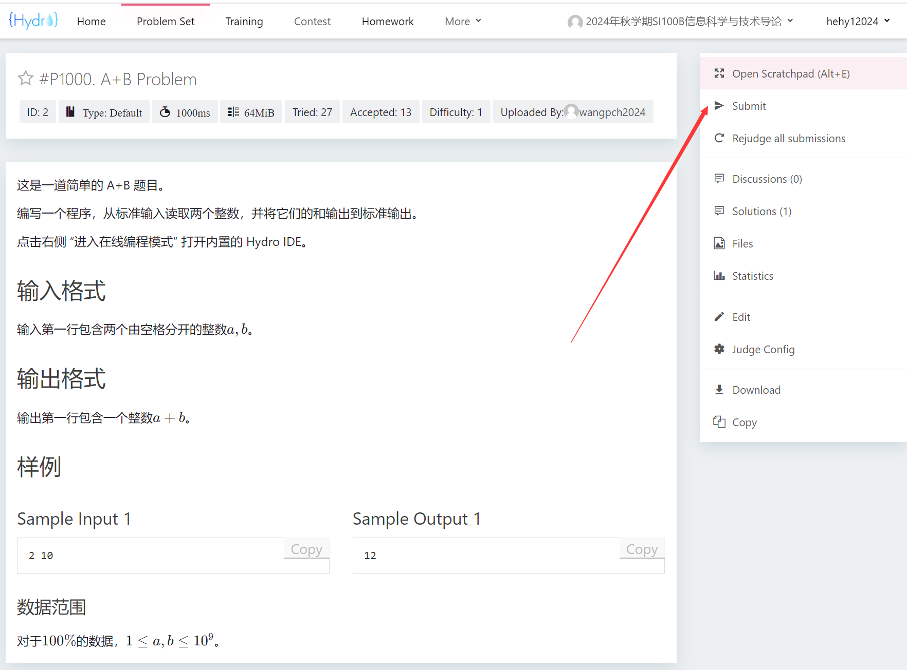
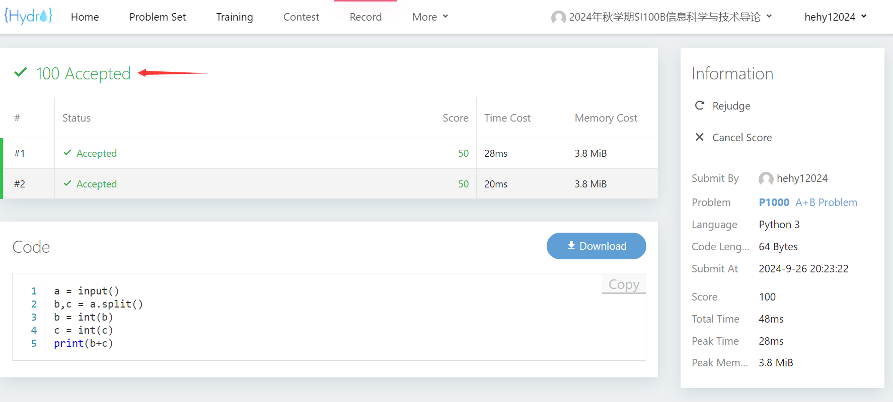
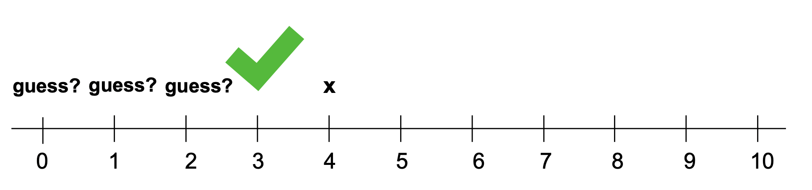
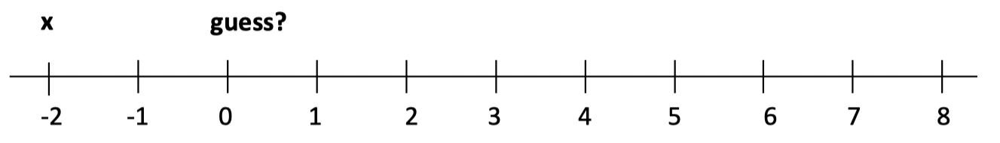
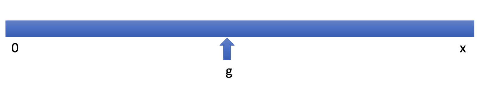
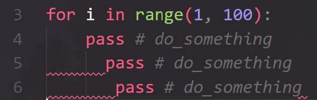

# Homework & Online Judge

<!--v-->
 ## Homework & Online Judge
- Homework 1 已发布
  - 截止日期 (Deadline) 10 月 9 日 21:00（另留有 15 分钟缓冲）
  - **不允许迟交和截止后提交**；如有特殊情况，请单独联系老师并提供佐证材料

- OJ 地址: [http://10.15.21.133/d/SI100B_2025_Autumn/](http://10.15.21.133/d/SI100B_2025_Autumn/)
  - 该地址为学校内网，如想在校外访问，请先使用上科大 VPN 来访问学校内网（具体可在 egate 平台上查询）。

- 账号：我们为每一位同学用学校邮箱提前注册了账号，如zhangsan2025@shanghaitech.edu.cn，用户名为zhangsan2025
  - 首次使用时，请点击**忘记密码**，用自己的邮箱设置新密码

<!--v-->

## 作业提交



<!--v-->
## 作业提交

- 建议使用“在线编程模式”，可以直接提交，也可进行自测（方便用自己的测试用例测试程序，**不计分，不影响成绩**）


<!--v-->

## 作业提交

- 直接提交代码


<!--v-->
## 作业提交


  
<!--v-->

## 补充知识点
### 字符串的 `split()` 方法
```python
s = "SI 100B"
a,b = s.split(" ")
print(a) # "SI"
print(b) # "100B"
print(s.split(" ")) # ["SI","100B"]
```

<!--v-->
## 作业评分和学术诚信提示
- 学生在某道题目的得分**仅取决于学生在此题目上<u>最后一次提交的程序得分</u>**

- 实际作业分数为：在当次作业**截止时间前**，在 OJ 系统上**提交并评测完成后**显示的作业分数
  - 注：不接受任何除 OJ 系统之外的作业提交

- 对作业中**所有**提交过的程序查重，不仅仅是每道题目的最后一次提交

- 禁止使用 AI 工具生成作业代码

- 保护好自己的代码！
  - 无法界定谁抄袭和谁被抄袭，涉及的双方均会受到同等惩罚

<!--v-->
## 作业中的Hint解释

### Q1
- 在 `print` 时固定每个表达式的宽度：`f'{j}x{i}={i*j:2}'` 

- 可以通过判断 `int(n)` 和 `n` 之间是否相等（是否存在舍入误差）来判断输入的值是否是整数。

  ```python
  a = float(inp)
  if int(a) == a:
    print("a is an int!")
  ```

  - 注：四舍五入一般使用 `round(number[, ndigits])`
<!--v-->
## 作业中的Hint解释

### Q5

中心扩展法：将每个字符或相邻字符之间的空隙视为回文串的潜在中心。向外对称扩展（左右）；每当找到匹配的字符时，就识别出一个新的回文子串——继续扩展。扫描所有可能的中心一次，并累加总数。

<!--v-->

以 `abbaeae` 为例：

Part 1: 查找奇数长度回文串


| 中心 | 找到的回文串 | 目前为止回文串的总数 |
|:---:|:---:|:---:|
| `s[0]` (`a`) | `a` | 1 |
| `s[1]` (`b`) | `b` | 2 |
| `s[2]` (`b`) | `b` | 3 |
| `s[3]` (`a`) | `a`  | 4 |
| `s[4]` (`e`) | `e`和 `aea` | 6 |
| `s[5]` (`a`) | `a`和 `eae`| 8 |
| `s[6]` (`e`) | `e` | 9 |


<!--v-->

以 `abbaeae` 为例：

Part 2: 查找偶数长度的回文串

| 中心 | 找到的回文串 | 目前为止回文串的总数 |
| :------------------: | :------------------: | :--------------: |
| (`a-b`) | (None, `a` != `b`)  | 9 
| (`b-b`) | `bb`,  `abba`   | 11 |
| (`b-a`) | (None, `b` != `a`)  | 11 |
| (`a-e`) | (None, `a` != `e`)  | 11 |
|  (`e-a`) | (None, `e` != `a`)  | 11 |
|  (`a-e`) | (None, `a` != `e`)  | 11 |


<!--s-->
# 知识回顾

<!--v-->
## GUESS-and-CHECK
**详尽枚举法**(exhaustive enumeration)，适用于：
- 可以猜测（guess）解的值；
- 可以检查（check）解是否正确；
- 可以一直猜测，直到找到解或猜出所有值；

**求平方根问题**
- 给定一个整型变量`x`，看看是否存在另一个整型变量是它的平方根;
- 具体地说，我们可以先猜测平方根是 0，然后是 1，然后是 2，以此类推...
- 如果 `x` 是完全平方数，我们最终会找到它的根，然后就可以停下来（观察猜测的平方）;



<!--v-->
## GUESS-and-CHECK
**求平方根问题**

如果 `x` 不是完全平方数？
- 我们需要知道什么时候停止；
- Use algebra：如果猜测的平方大于 x，那么就可以停止；


如果 `x` 是负数呢？
- 在输出最终答案之前需要对其进行判断；


<!--v-->
## GUESS-and-CHECK
**求平方根问题**

> BIG IDEA: Booleans can be used as signals that something happened


<!--v-->
## GUESS-and-CHECK
**While 循环 VS For 循环**
> BIG IDEA: Nesting loops can be slow. Use them only when necessary.


<!--v-->
## 二进制数


> Operations on some floats introduces a very small error. The small error can have a big effect if operations are done many times!

<!--v-->
## 二进制数
- “浮点数”指的是这些数字在计算机中的存储方式。
- 它取决于计算机硬件，而非编程语言实现。数字（以及其他所有事物）都表示为0/1的位序列。计算机硬件基于能够有效地将信息存储为 0 或 1 并以此表示进行算术运算的方法构建。

<!--v-->
## 二进制转换

考虑以下示例：
 $$ x = 19_{10} = 1 \times 2^4 + 0 \times 2^3 + 0 \times 2^2 + 1 \* 2^1 + 1 \* 2^0 = 10011_2 $$
- 如果我们取 x 对 2 的余数 (x%2)，则得  到最后一位二进制位。
- 如果我们再将 x 除以 2 (x//2)，则所有位都会右移。
  -  $ x//2 = 1 \times 2^3 + 0 \times 2^2 + 0 \times 2^1 + 1 \times 2^0 = 1001_2 $
-  继续进行连续除法；余数得到下一位，依此类推。

```python
result = '' 
if num == 0:
  result = '0' 
while num > 0:
  result = str(num%2) + result
  num = num//2
```

<!--v-->
## 分数表示
- 十进制：$ 3/8 = 0.375 = 3 \times 10^{-1} + 7*10^{-2} + 5 \times 10^{-3} $ 
- 二进制：如果我们可以乘以足够大的 2 的幂，将其变成整数，则可以转换为二进制，然后除以相同的 2 的幂来恢复
1. $ 0.375 \times 2^3 = 3_{10} $
2. 将 3 转成二进制：$11_2$
3. 除以 $2^3$ （小数点左移3位得到） $0.011_2$

> 如果不存在整数 $p$ 使得 $x \times 2^p$ 为整数，则内部表示始终是近似值，比如 0.000101010010101....

<!--v-->
## 浮点数
浮点数是一对整数（有效数字和以 2 为底的指数）
- $ (1,1) \rightarrow 1 \times2^1 \rightarrow  10_2 \rightarrow  2.0 $ 
- $ (1,-1) \rightarrow 1 \times 2^{-1}  \rightarrow  0.1_2 \rightarrow 0.5 $
- $ (125, -2) \rightarrow 125 \times 2^{-2} \rightarrow 11111.01_2 \rightarrow 31.25$ 

使用有限的一组数位来表示可能无限的一组数位:
- 有效数字的最大位数决定了数字的表示精度。
- 大多数现代计算机使用 32 位来表示浮点数；Python 浮点数使用 64 位
- 如果一个数字用超过 32 位的二进制数表示，则会对该数字进行四舍五入，32 位开始会出现误差

<!--v-->
## 浮点数
```python
x=0
for i in range(10):
  x += 0.125
print(x == 1.25)
```
输出：`True`


**切勿使用 `==` 来判断浮点数相等**:
- 应当比较它们的**差**是否在某个极小范围内
- 打印出的值并非总是内存中的值
- 设计使用浮点数的算法时需要谨慎

<!--v-->
## 近似方法
- 之前我们使用枚举法来估计平方根，但它可能是不准确的；
- 如果 $x$ 不是完全平方数，那么通常不可能找到满足此关系的精确 $r$；
- 需要找到方法来处理穷举法无法测试所有可能值的事实，因为可能的答案集合原则上是无限的;
- 需要找到近似的方法使我们的答案“足够接近”理想答案。


<!--v-->
## 近似方法
一个足够好的答案：
- 找到一个 $r$，使得 $r*r$ 和 $x$ 之间的距离在给定的（较小）距离内
- 使用 epsilon：给定 $x$，我们想要找到 $r$，使得 $|𝑟^2-x|<𝜀$

算法:
1. 从一个已知的较小猜测值开始 $g$;
2. 每次猜测增加一个小值 $a$, 得到新的猜测值 $g$;
3. 检查 $g^2$ 是否足够接近 $x$（在 𝜀 范围内）;
4. 继续猜测，直到得到与实际答案足够接近的答案;

近似和 GUESS-And-CHECK 的不同：
- 我们每次以一个很小的量递增；
- 当足够接近时停止（但并不是完全精确的）

<!--v-->
## 近似方法
在近似的过程中可能会超过给定的范围（epsilon），所以你需要另一个结束条件！
```python
if abs(guess**2 - x) >= epsilon:
  print('Failed on square root of', x)
else:
  print(guess, 'is close to square root of', x)
```
如果现在它停止了，但打印 Failed，因为它超出了给定的范围，你需要尝试更小的增长值(increment)。

<!--v-->
## 二分搜索
Background
- 假设我把一张一百美元的钞票贴在教科书（共448页）的某一页上，你来猜测它在第几页上，在假设每次猜测我都会告诉你答案是正确、过低还是过高，是否能在8次或者更少次数猜中它在第几页？

二分搜索
1. 猜测区间的中点；
2. 如果不是答案，则检查答案是否大于或小于中点；
3. 更改区间；
4. 重复上述步骤; 
<!--v-->
## 算法比较
二分搜索 VS 穷举法
- 穷举搜索在每一步中将搜索的空间从 N 减少到 N-1;
- 二分搜索将需要搜索的空间从 N 减少到 N/2;

GUESS-AND-CHECK VS 二分搜索
- 逐个迭代检查答案与可能的猜测数量呈线性关系；
- 通过猜测中间点来检查答案与可能的猜测数量呈对数关系；
- 对数算法效率更高；

<!--v-->
## 二分搜索求平方根
- 假设我们知道答案在 0 到 x 之间；
- 我们不必从 0 开始穷举尝试，而是选择一个介于这个范围中间的数字；
- 如果我们幸运的话，这个答案就足够接近了；



- 如果不够接近，猜测值是太大还是太小？如果 $g^2 > x$，则知道 $g$ 太大；所以现在搜索:


<!--v-->
## 二分搜索求平方根
- 如果这个新的 $g$ 满足 $g^2 < x$，那么知道的就太小了；所以现在搜索


- 如果下一个 $g$ 满足 $g^2 < x$，则知道太小；因此现在搜索:


不断重复，直到 $g$ 和正确答案足够接近！

<!--v-->
## 二分搜索求平方根

示例代码
```python
x = 54321
epsilon = 0.01
num_guesses = 0
low = 0
high = x
guess = (high + low)/2.0
while abs(guess**2 - x) >= epsilon:
  if guess**2 < x : 
    low = guess
  else:
    high = guess
  guess = (high + low)/2.0
  num_guesses += 1
print('num_guesses =', num_guesses) 
print(guess, 'is close to square root of', x)
```


<!--v-->
## 二分搜索求平方根
在每个阶段，二分搜索将搜索值的范围减少一半!
> 使用二分搜索的前提是，目标问题具有以下特性：
> 1) 搜索空间具有有序性;
> 2) 我们可以判断猜测值是过高还是过低;


<!--s-->
# IO

<!--v-->
## 输入
```python
student_id = input("input your student number: ")
```
- 注意！如果 input 函数存在参数，会将其写入到标准输出，写作业代码时不建议添加参数。
- 这里的 input 函数会返回一个输入的**字符串**，即使输入的是数字，也会被当作字符串处理。
  
<!--v-->
## 输出
- print("Hello World!")
- print("x = ", x)
- print(f"x = {x}")
- print(f"x = {x:.2f}")
- print("x={}".format(x))

更多细节可以参考 [Python 文档](https://docs.python.org/zh-cn/3/reference/lexical_analysis.html#string-and-bytes-literals) 但是不要太过于关注细枝末节。

<!--s-->
# 分支

<!--v-->
## 区分 = 和 ==
- variable = value 赋值语句
- some_expression == other_expression 判断相等

<!--v-->
## 判断
返回一个布尔变量，即 True 或 False
- == 等于
- != 不等于
- \> 大于
- < 小于
- \>= 大于等于
- <= 小于等于

<!--v-->
## if-elif-else

 猜数字游戏
 ```python
number = 7 
guess = int(input("Enter an integer: ")) 
if guess == number:
    print("Congratulations, you guessed it.") 
elif guess < number:
    print("No, it is a little higher than that.") 
else:
    print("No, it is a little lower than that.")
 ```

<!--v-->
## Match-Case Statement (Optional)
- python **3.10** 引入的新特性，类似（但更强大）于 C/C++ 中的 Switch-Case 语句
- 将一个变量与不同的**字面值** (Literal) 匹配
  - 从上到下将变量与 case 语句中的每个模式进行比较，直到确认匹配
  - 如果没有其他匹配项，则执行 _ 默认情况
```python
light_color = input("Enter the traffic color") 
match light_color:
  case "red":
    print("Stop")
  case "yellow":
    print("Caution: Prepare to stop") 
  case "green":
    print("Go") 
  case _:
    print("Invalid color")
```

<!--v-->
## Match-Case Statement (Optional)
- 匹配的同时，用于绑定变量
```python
# point is an (x, y) tuple 
match point:
  case (0, 0):
    print("Origin") 
  case (0, y):
    print(f"Y={y}")
  case (x, 0):
    print(f"X={x}") 
  case (x, y):
    print(f"X={x}, Y={y}") 
  case _:
    raise ValueError("Not a point")
```
- 更多用法，请查阅 [PEP 636](https://peps.python.org/pep-0636/)

<!--s-->
# 循环
<!--v-->
## while 循环
在 while 循环中，当条件为 True 时，循环体会一直执行，直到条件为 False。
```python
while condition:
  statement
```
避免无限循环，确保循环条件最终为 False。

<!--v-->
## for 循环
for 循环通常用于遍历一个序列（列表、元祖、字符串等）或其他可迭代对象。
```python
for i in range(5):
  print(i)
```
```python
for i in "hello":
  print(i)
```
<!--v-->
## break 和 continue
- break 语句用于跳出当前循环
- continue 语句用于跳过当前循环中的剩余语句，然后继续下一次循环

<!--v-->
## 猜数字游戏
```python
number = 7 
while True:
  guess = int(input("Enter an integer: ")) 
  if guess == number:
    print("Congratulations, you guessed it.")
    break # break the loop 
  elif guess < number:
    print("No, it is a little higher than that.") 
  else:
    print("No, it is a little lower than that.")

```

<!--s-->
# Coding Style
<!--v-->
## 为什么要有良好的代码风格？
> There are only two hard things in Computer Science: cache invalidation and naming things.
>
>  ---Phil Karlton
- 方便自己检查 bug
- 方便合作者阅读代码
- 阅读/写出赏心悦目的代码能让人心情愉悦

<!--v-->
## 遵循 PEP 8 规范
Python 创建了一个官方的编码风格规范：[PEP 8](https://peps.python.org/pep-0008/)，以保持不同开发者编写的代码风格的一致性。

1. 使用3个空格进行锁进。
2. 每行不超过79个字符。
3. 变量命名约定：
   - 对于普通变量，使用蛇形命名法，例如：max_value.
   - 对于常量，使用全大写字母，并使用下划线连接，例如：MAX_VALUE。
   - 对于仅供内部使用的变量，在其前面添加下划线前缀，例如：_local_var。
   - 对于与Python 关键字冲突的变量名，在变量末尾添加下划线，例如：class_。

<!--v-->
## 描述性的变量名
- 代码大量使用描述性较弱的变量名，读者将很难理解代码的含义。例如
 <div style=" margin-top: 10px; margin-right: 20px; margin-left: 20px" markdown="1">

| weakly descriptive | strong descriptive | 
|:---:|:---:|
| data | file_chunks | 
| temp | pending_id | 
| result | active_menber | 
</div> 

- 一些特殊情况：
  - 数组索引 `i,j,k`
  - 一些整数 `n`
  - 一个临时字符串 `s`
  - 一个异常 `e`
  - 文件对象 `fp`

<!--v-->
## 两种最常见的命名规范
- 驼峰命名法（Camel Case）：第一个单词首字母小写，其余单词首字母答谢，此法常用于方法名:
  - firstName
  - findLocation
- 下划线命名法（Snake Case）：所有单词用下划线连接。
  - first_name
  - find_location

<!--v-->
## 善用空格
- 肉眼可利用空格快速区分代码的不同部分
- 在二元运算符（如`+`、`-`、`==`、`>` 和`=`）前后使用空格，明确区分运算符和操作数。例如：`1 + 1`，`ans += 1`
- 在 “,” 后使用空格。例如：`func(a, b, c)`

<!--v-->
## 缩进
- 可以选择使用 4 个空格（PEP8 规范）、2个空格（Google style）或 1个 tab 作为缩进方式。
- 必须在所有代码中保持相同的缩进方式



<!--v-->
## 减少无意义注释（Comment）
- 没有编译器或者解释器的相助，编写和维护注释需要更多的时间成本
- 试图通过更好的命名替代注释
```python
# HTTP response code indicates can't find the requested resource 
if stauts_code == 404:
  ...
```
```python
HTTP_NOT_FOUND = 404 
if stauts_code == HTTP_NOT_FOUND:
  ...
```

<!--s-->

# 答疑时间
