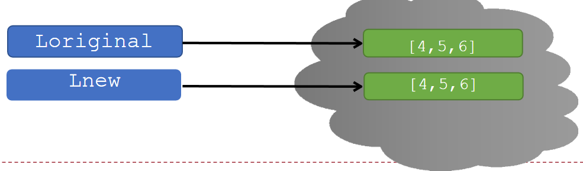
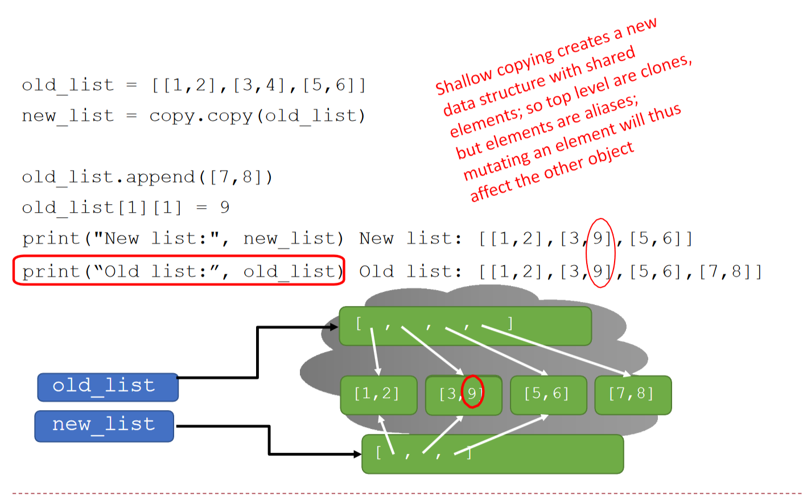
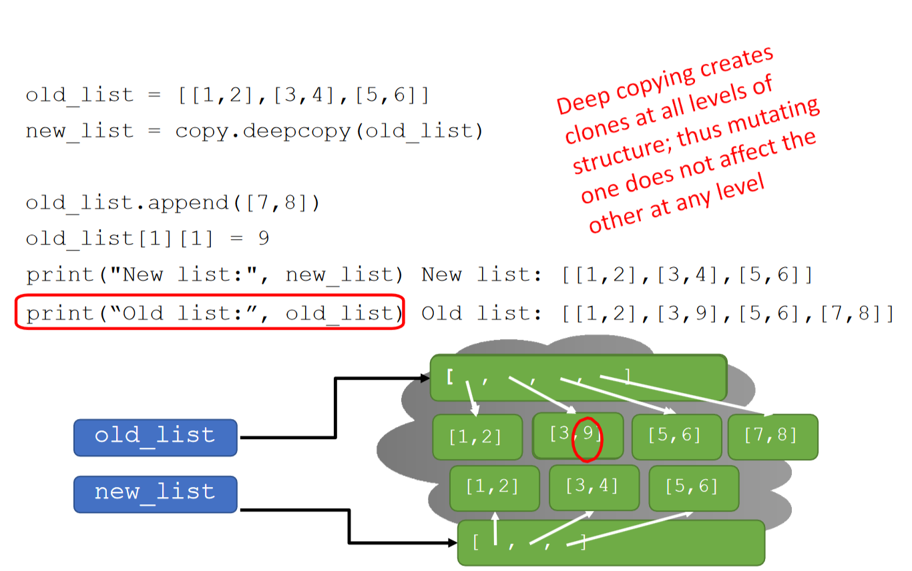

# Homework 2 说明

<!--v-->

## Homework 2

- 已在 OJ 上发布

- Deadline：10/23（周四）21:00（外加 15 min 缓冲时间）

- BlackBoard 上已发布题目的书面 PDF 版本
    - PDF 版本的 **样例输入输出** 可能有格式问题，**建议优先参考 OJ**

<!--v-->

## Q1 题目说明

**HW201  Calculator with lambda functions**

- `get_op` 应返回一个 lambda 函数，注意检查函数**返回值是否正确**

- 所提交的内容应当**仅有 `get_op` 和 `calc` 这两个函数**
    - 除此之外不要包含其他代码（比如自己测试用的 `print`）

```py[]
def get_op(op_name):
    # your implementation here

def calc(op, x, y) -> float:
    # your implementation here

# Do not write anything else! (e.g. print(calc("add", 1, 2)) )
```

如得到 Compile Error / Runtime Error，则很可能是没有遵守这两条导致

<!--v-->

## Q2 题目说明

**HW202  Image Linear Enhancement**

- **读题**，明确概念和步骤

- 注意**输入和输出格式**

<!--v-->

## Q3 题目说明

**HW203  Simplified Match-3 Game**

实现简单的三消游戏

- 题目较复杂，**一定注意读题！**
    - 包含一些“反常识”的定义，如游戏网格坐标（1-起始，左上 (1, 1)）

- 注意**输入和输出格式**

<!--v-->

### Q3 题目样例
开始：输入版面的行列大小和内容
```py
>>> 3 3
    A B C
    B C A
    C B A
# 输出当前版面的内容和得分
# （测试时不会输入已有符合三消匹配的版面，起始得分是 0）
A B C
B C A
C B A
0
```

<!--v-->
游戏过程：输入 *swap*，输出 ***swap* 后** 的版面内容和得分

```py
>>> swap 1 1 2 1
# 1 行 1 列 和 2 行 1 列交换
# 无效操作：此 swap 不能形成三消匹配
A B C
B C A
C B A
0

>>> swap 2 1 2 2
# 2 行 1 列 和 2 行 2 列交换
# B 被交换到三个匹配的中间，构成有效操作，中间一列消去
A . C
C . A
C . A
30
```

<!--v-->
```py
>>> swap 1 1 3 3
# 1 行 1 列 和 3 行 3 列交换
# # 无效操作：不允许交换不相邻的块
A . C
C . A
C . A
30
```

退出游戏：输入 *exit*，输出最终的得分
```py
>>> exit
30
```

<!--v-->
## Q3 题目说明

**HW204  F1 Race Data Analyst**

根据输入的赛事数据和请求的功能，输出对应的计算结果

- 题目较复杂，**注意读题**
    - 包含许多概念和计算公式
    - 仔细阅读需要你实现的各个命令及细节

- 注意**输入和输出格式**！

<!--v-->
- 主要考察点：为每个命令编写对应的处理逻辑
    - 推荐将不同的逻辑**封装到独立的函数中**
        - **便于复用**、可读性更好、有利于测试和维护……

    - **不要**把所有逻辑堆在一个大的分支结构中，比如类似下面这样：
    ```py[]
    def process_race_data(command, data):
        if command == "lap_time":
            # 计算单圈时间的大量代码
            result = data['s1'] + data['s2'] + data['s3']
            # ... 更多计算和逻辑
            return result 
        elif command == "total_time":
            # 计算总时间的大量代码
            result = data['s1'] + data['s2'] + data['s3'] + data['pit_stop']
            # ... 更多计算和逻辑
            return result
        ...
    ```

<!--s-->
# Functions as Objects

<!--v-->
## Functions as Objects
- 回顾：“Python 中，函数是一等公民”

- 函数可以像其他数据类型一样被传递、赋值和使用

- 示例：灵活折扣系统
    - 定义主函数`apply_discount(price, discount_strategy)`
    - `discount_strategy`是一个函数，计算折扣金额

<!--v-->
### Example: Discount Strategy System
```py
def apply_discount(price, discount_strategy):
    discount = discount_strategy(price)
    final_price = price - discount
    return final_price

# 定义一些折扣策略函数
def fixed_discount(price):
    """固定折扣 - 减 10 元"""
    return 10

def bulk_discount(price):
    """批量折扣 - 满 100 打 8 折，否则 9 折"""
    if price > 100:
        return price * 0.2  # 20% 折扣
    return price * 0.1     # 10% 折扣
```
- Lambda function 的形式？

<!--v-->
### 使用示例

```py
original_price = 150.0

# 固定折扣
apply_discount(original_price, fixed_discount) # 进行的计算：150.0 - 10

# 批量折扣
apply_discount(original_price, bulk_discount) # 150.0 - 150.0 * 0.2

# 也可以直接使用 lambda 函数……
apply_discount(original_price, lambda p: p * 0.15)  # 15% 折扣
```

<!--s-->
# Tuple
<!--v-->
## Tuples（元组）
- 一种新的复合数据类型

- 不可变（immutable）

- 用圆括号`()`表示

- 支持索引、切片、合并、长度、最大/最小值等操作


**Tuples操作示例**
```python
tuple_empty = ()      # 空元组
tuple_short = (2,)    # 单元素元组需加逗号
hello_tuple = (2, "stu", 3)
hello_tuple[0]   # 2
hello_tuple[1:3] # ("stu", 3)
```

<!--v-->

## 接受任意数量的参数

一些内置函数的参数数量不固定，可接受任意数量的参数，如 `min()`, `max()`, `mean()`。

自己写函数时，可在某个参数前加 `*` 符号来实现相同功能：

```py
def mean(*args): tot = 0
    print(type(args)) # tuple
    print(args) # tuple
    for a in args:
        tot += a
return tot / len(args)
mean(1, 2, 3, 4, 5, 6) # args: tuple (1, 2, 3, 4, 5, 6)
```

上例中，`args` 绑定到所提供的若干值组成的**元组**。

<!--s-->
# 拓展：Tuples
<!--v-->
## Properties of Tuples

- Tuple is about immutability（不可变）

- It encapsulates a _linear_ order, like a _struct_, but without field names.
    - You don't want to accidentally modify its structure!
    - e.g. A list of points in $\mathbb {R}^2$: `[(0.2, 0.3), (1.1, 1.2), ...]`

- Is _hashable_ (if its elements are hashable), therefore can be used as keys in dictionary (`dict`).

<!--v-->
## Properties of Tuples
- Singletons（可作为单例）
  ```py
  >>> 1 == (1) != (1,)
  True
  ```
- Constructors（可直接构造对象）
  `tuple()` accepts iterables

- Packing and Unpacking
  ```py
  temperature, humidity = get_weather()
  a, b, c = c, a, b
  ```
  
<!--v-->
Linear Operations...
- Linear indexing, Slicing
  ```py
  ('a', 'b', 'c', 'd')[3] == 'd'
  (0, 1, 2, 3, 4, 5)[1:3] == (1, 2)
  (0, 1, 2, 3)[::-1] == (3, 2, 1, 0)
  ```
- Concatenation, Repeating
  ```py
  (1, 2, 3, 4) + (10, 11) == (1, 2, 3, 4, 10, 11)
  (1, 2) * 3 == (1, 2, 1, 2, 1, 2)
  ```
- Sorting
  ```py
  sorted_tuple = tuple(sorted(original_tuple))
  ```

<!--s-->

# List

<!--v-->
## List (列表)
- 可变（mutable）序列
- 用方括号`[]`表示
- 可包含任意类型元素
- 支持索引、切片、合并、迭代等操作

```python
empty_list = []
hello_list = [2, "a", 4, [1, 2]]
hello_list[0]      # 2
hello_list[3]      # [1, 2]
[1, 2] + [3, 4]    # [1, 2, 3, 4]
```
<!--v-->
## 常用的 List 的方法
- `append(element)`：在末尾添加元素；无返回值 (`None`)

- `sort()`：原地对元素进行排序；无返回值 (`None`)
    - 默认正序；加上可选参数 `reverse=True`为倒序
    - 可指定要参照哪个关键字进行排序；详情查阅 Python 手册

- `reverse()`：原地反向排列元素；无返回值 (`None`)

- `sorted(list)`：返回新排序的列表；**不修改原列表**

**“原地”/“就地”**：对对象本身进行修改
<!--v-->
## Lists与函数
可传递列表给函数，函数内可修改原列表（副作用）
示例：平方列表中所有元素
```python
def square_list(L):
    for i in range(len(L)):
        L[i] = L[i] ** 2
```
<!--v-->
## 字符串与列表互转
字符串转列表：
- `list(s)`：每个字符作为元素
- `s.split(char)`：以字符 `char` 作为分隔符，进行分割

列表转字符串：
- `'_'.join(L)`：用指定字符连接
    - `''.join(L)`：将列表中的所有元素连成一整个字符串


<!--s-->
# Aliasing & Cloning (Copying)

<!--v-->
## 回顾：可变对象和不可变对象
- **可变 (Mutable) 对象**：如果要修改对象，可直接原地修改，不用重新创建；
  - 常见类型：列表 `list`，字典 `dict`，集合 `set` 等
  - 例：可直接添加、删除或更改列表的元素

- **不可变 (Immutable) 对象**: 对象一旦创建便不可更改；若要修改，只能重新创建一个新的
  - 常见类型：字符串 `string`，整型 `int`，元组 `tuple` 等
  - 例：“修改”一个整数，实际上创建了一个新的整型对象并删除了原先的；元组一旦创建，其内容无法修改

<!--v-->
## 为什么需要 Copy？
- 赋值语句只是为一个对象**另起**了一个名字（aliasing）

- 对于自身可变的对象，会使目标和对象同时改变
    - 许多情况下会导致意外修改

```py
l1 = [1, 2, 3]
l2 = l1
l2.append(4)
print(l2)  # [1, 2, 3, 4] modified
print(l1)  # [1, 2, 3, 4]
```

<!--v-->
### 回顾：函数传入可变对象
- 场景：函数可能对传入的参数进行修改
    - 若传入了可变对象，函数对参数进行的修改将直接影响其原始对象

```py
def foo(l2):
    print("Id of l2 before revised:", id(l2))
    l2.append(4)
    print("Id of l2 after revised:", id(l2)) # same
 
l1 = [1, 2, 3]
print("Id of l1:", id(l1))
foo(l1)
print(l1) # [1, 2, 3, 4]
```

<!--v-->
## 对一个列表进行 Copy
改变生成的副本不会影响原始对象

`l2 = l1[:]`，或 `import copy` 后 `l2 = copy.copy(l1)`
- 等价于：创建空列表 `l2` - 遍历 `l1`，将 `l1` 的每个元素依次 `append` 进 `l2`
```py[]
l1 = [4, 5, 6]
l2 = l1[:]
l2.append(7)
print(l2)  # [4, 5, 6, 7]
print(l1)  # [4, 5, 6]
```


<!--v-->
## 有嵌套的可变对象：避免 Shallow Copy 
- 上述 `l2 = l1[:]` 和 `l2 = copy.copy(l1)` 都属于浅拷贝（Shallow Copy）
- 浅拷贝 **仅拷贝嵌套的第一层** ，第二层或更深（例如其中的可变对象）不会被拷贝



<!--v--> 
## 有嵌套的可变对象：Deep Copy
- 当嵌套结构中的元素可能是可变对象时，使用**深拷贝**
    - 确保每个嵌套层级的每个结构都被复制


<!--v-->
## (Optional) 如果只拷贝 k 层呢? 
```py[]
def k_level_copy(obj, k):
    if k <= 0:
        return obj
    if isinstance(obj, list):
        new_list = []
        for item in obj:
            new_list.append(k_level_copy(item, k - 1))  
        return new_list
    elif isinstance(obj, dict):
        ...
    else:
        return obj  # Return the object if it's immutable
```

<!--v-->
## (Optional) 如果只拷贝嵌套的前 k 层呢?
```py
# Example usage
original = [1, [2, [3, [4 , 4]]]]
deepk_copied = k_level_copy(original, 3)

# Modify the deep copy
deepk_copied[1][1][0] = 'Changed'
deepk_copied[1][1][1][1] = 'Changed'
print(original) # [1, [2, [3, [4, 'Changed']]]]
print(deepk_copied) # [1, [2, ['Changed', [4, 'Changed']]]]
```
- `k_level_copy(original, 1)` 等价于 `copy.copy(original)` 
- `k_level_copy(original, 4)` 等价于 `copy.deepcopy(original)` 

<!--v-->
## 更多例子
```py
import copy
orig = ['Hi, I am ', list('Bob')]
alias = orig
shallow = orig.copy()
deep = copy.deepcopy(orig)
orig[0] = 'Hi, he is'
orig[1][0] = 'C'
print(orig, alias, shallow, deep, sep='\n')
```
What should be the output?

<!--v-->
## 更多例子
```text
['Hi, he is', ['C', 'o', 'b']]
['Hi, he is', ['C', 'o', 'b']]
['Hi, I am ', ['C', 'o', 'b']]
['Hi, I am ', ['B', 'o', 'b']]
```
<!--v-->
## Some cool list comprehension solutions
```py
def remove_all(l, val):
    return [x for x in l if x != val]
```
```py
def remove_dups(L1, L2):
    return [x for x in L1 if x not in L2]
```
<!--s-->

# 拓展：Decorators

<!--v-->

> Anything in Python is an object.

```py
def nice():
    print('hello')
def apathetic():
    print('...')
```

```py
import random
logic = {0: nice, 1: apathetic, 2: nice}
logic[random.randint(0, 2)]()
```

```text
hello
```

<!--v-->

作为对象传递：

```py
def plus(x, y):
    return x + y
def div(x, y):
    return x / y
def perform(x, y, op):
    print(op(x, y))
    
perform(2, 3, div)  
perform(2, 10, lambda x, y: x**y) 
```
```text
0.6666666666666666
1024
```

<!--v-->

作为函数的返回值：
```py
def wrapper(rapper):
    def greet():
        print('This is rapper ' + rapper + '.')
    return greet

wrapper('Ken')()  

```
```text
This is rapper Ken.
```

<!--v-->
If a function takes a function as argument and returns a function, it can actually produce a modified version of the argument function. Python allows us to perform such modification with the notation `@`.

```py
# The decorator 
def triplet(f):
    def _inner(x):
        f(x)
        f(x)
        f(x)
    return _inner

def annihilator(f):
    def do_nothing(*args, **kwargs):
        pass
    return do_nothing
```
<!--v-->
```py
@triplet
def say(name):
    print('hello ' + name)
    
@annihilator
def say_goodbye(word):
    print(word)
```

```py
say('world')
print('----')
say_goodbye('I will miss you', time = 2)
```

```text
hello world
hello world
hello world
----
```

<!--v-->
An example from wiki.python.org:

```py
def __main__(func):

    if __name__ == "__main__":
        import sys, os
        args = sys.argv[:]
        args[0] = os.path.abspath(args[0])
        func(*args)
        
@__main__
def main(*args):
    print(f'main received {len(args)} arguments')
```

```bash
$ python main.py 1 2 3      
main received 4 arguments
```
<!--v-->

Some useful decorators, built-in or provided by modules...
- Call the function when program terminates: `@atexit.register`
- Checks if the values in a enum declaration is unique: `@enum.unique`
- Partial function that pre-specifies some parameters: `partial()`
  e.g. `lean_print = functools.partial(print, end = '', sep = '')`

More to be used in OOP...
- Generates `__init__` etc. (_class_ decorator!): `@dataclasses.dataclass`
- Declare static (global/within a class) functions: `@staticmethod`, `@classmethod`
- Getter method: `@property`


<!--s-->
# Exceptions

<!--v-->
## Unexpected conditions
- 当程序执行遇到意外情况时会发生什么？
- 出现与预期不同的异常
    1. 试图访问超出列表限制的内容
    2. 试图转换不合适的类型
    3. ...

```python
# 1. IndexError
test = [1,7,4]
test[4]

# 2. TypeError
int(test)

```


<!--v-->
## Handling Exceptions
- 通常，异常会导致错误发生并停止执行
- Python 代码可以提供异常处理程序,方便进行 debug
```python
try:    
    # do some potentially 
    # problematic code
except:
    # do something to
    # handle the problem
finally:
    # always executed after try
```
- 如果 try 块中的表达式全部成功,则继续执行 except 块之后的代码
- try 语句主体中任何语句引发的异常均由 except 语句处理，继续执行 except 语句主体 ，然后再执行该代码块之后的其他表达式
- 不管是否有异常触发，finally 后面的语句都会执行，这也是它

<!--s-->
# Assert

<!--v-->
目标：想要确保计算状态的假设符合预期
- 如果假设不成立，则使用断言语句引发 AssertionError 异常
- 断言 <应为真的语句>，“如果不成立则打印特定的提示”
- 断言不允许程序员控制对意外情况的响应
- 确保在预期条件不成立时停止执行
- 通常用于检查函数的输入
- 可用于检查函数的输出，以避免传播错误值
- 可以更容易地找到错误源
- 良好防御性编程的示例
```python
def avg(grades):
    assert len(grades) != 0, "No grades provided"
    return sum(grades) / len(grades)
````


